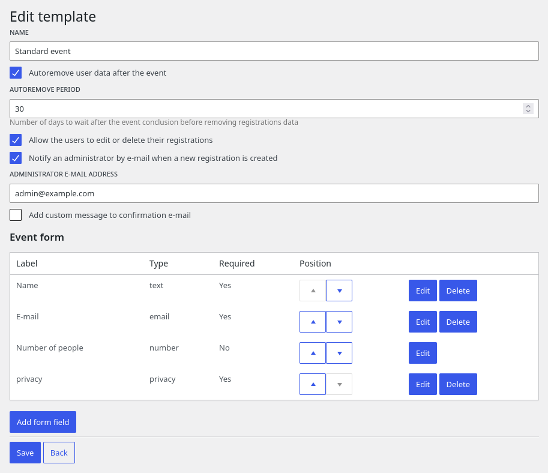
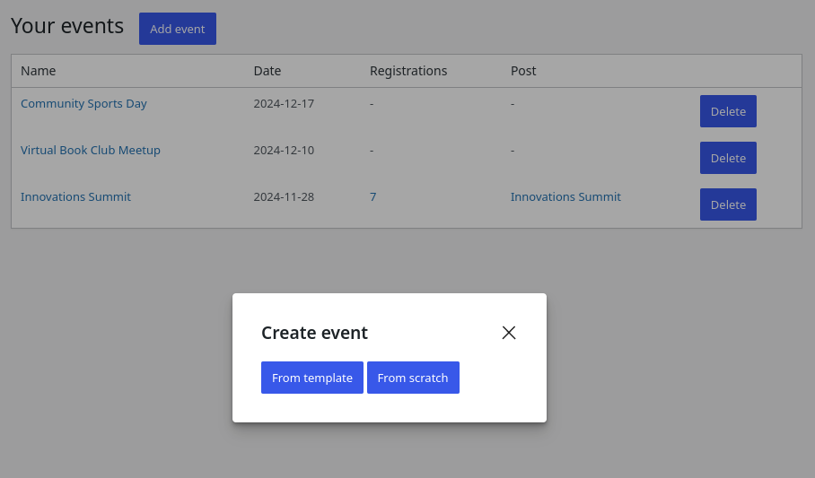
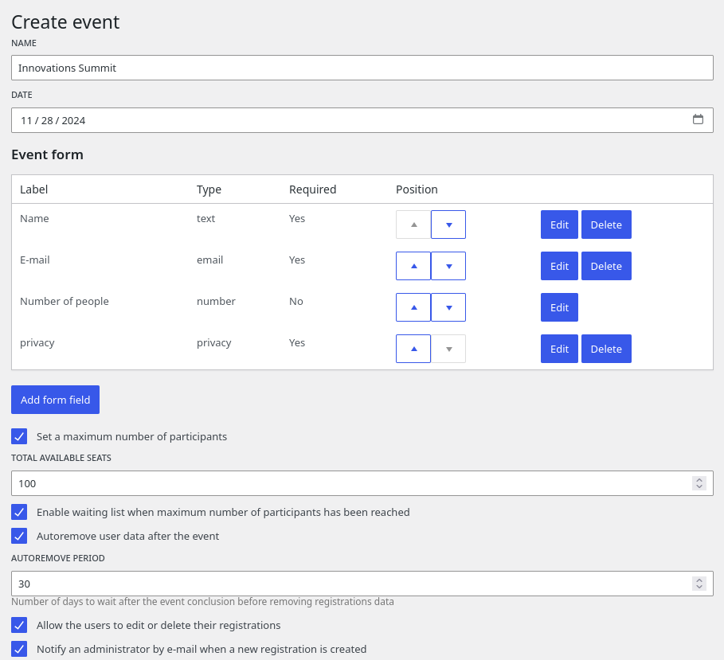
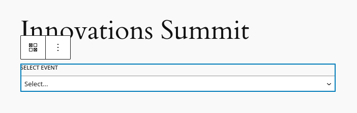
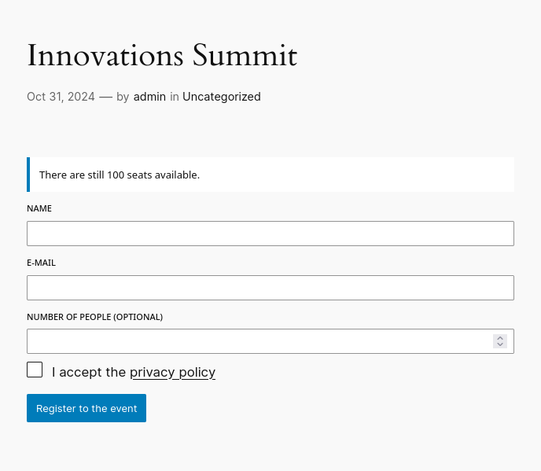
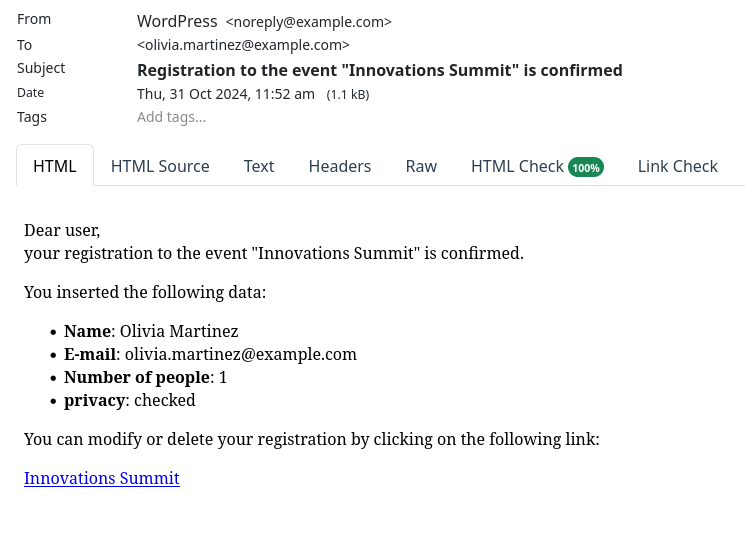
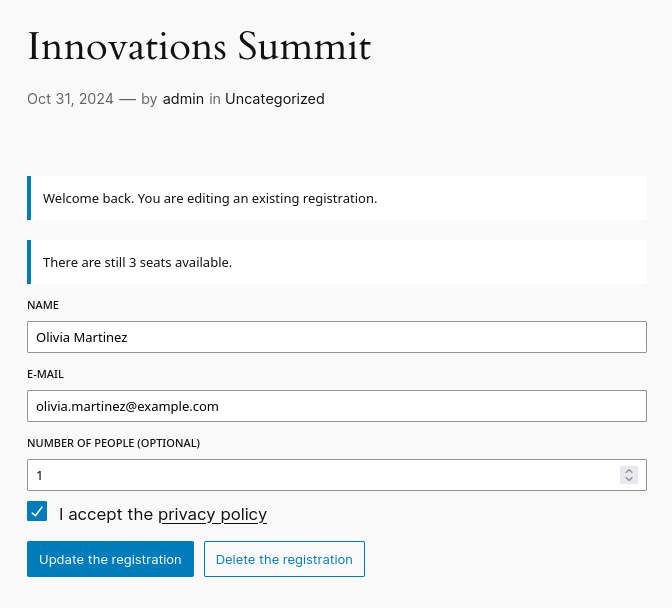
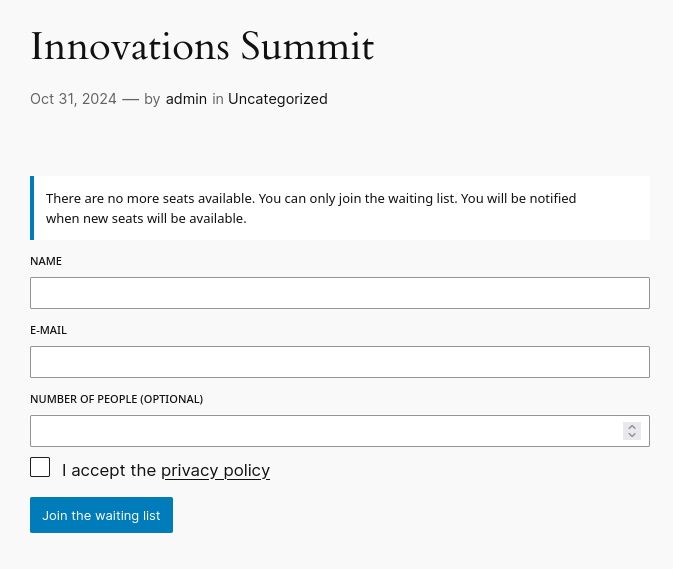

# WP Open Events

**WP Open Events** is a free and open-source WordPress plugin designed to manage registrations to events. It is based on the modern **Gutenberg** block editor.

Key Features:

* **Custom Form Builder**: Build the registration form for your events with the fields that you need. Currently supported elements are standard HTML fields like text, number and email inputs, dropdowns, checkboxes, radio buttons and some special field with custom logic (see next points).

* **Email Notifications**: Both administrators and users receive updates regarding registration confirmations, changes, and cancellations.

* **Available Seats Limit**: Set a maximum number of available seats for each event. The event automatically stops accepting new registrations when the limit is reached.

* **Waiting List**: When an event reaches its capacity, interested attendees can join a waiting list. The plugin automatically notifies them if a spot becomes available.

* **Autonomous Registration Editing**: Participants can edit or delete their bookings without needing to contact the event organizer.

* **Group Registrations**: Attendees can specify multiple people in a single registration. This feature is perfect for group events, enabling users to register friends, family, or colleagues all at once.

* **GDPR Friendly**: The plugin can automatically remove registrations after the event has ended and provides a field for accepting the privacy policy.

* **Event templates**: It is possible to create events from templates, to quickly create events having the same form and settings.

WP Open Events is available in the following languages:

* English
* Italian

## User guide

You can create an event from scratch or based on an event template. Creating a template is useful if you plan to organize several similar events and you need to use the same form and settings for each events.

The event template includes a form editor that enables you to define the fields of your registration forms. This same form will be available when creating a new event. When you create an event based on a template, you have the flexibility to overwrite any settings defined in the template.

To create a new event, navigate to the events list page and click the "Add Event" button. This action will open a modal prompting you to choose whether to create the event from scratch or based on a template.

On the event creation page, you can specify additional details, including the event name, the date and the maximum number of participants. The event date is needed to determine when the event form will be hidden after the event concludes and to perform the automatic removal of user data post-event (if the auto-removal setting is enabled).

After creating your event, you can add the event form to a post. To do this, search for the "WP Open Events Form" Gutenberg block. This block allows you to select the event from a list of upcoming events.

Once your post is published, the event form will be visible within it.

Users can register for the event and will receive a confirmation email upon successful registration.

Users have the option to edit or delete their registrations at any time, provided this feature is enabled.

If the event reaches full capacity, users can still join a waiting list (if this feature is enabled).

The administrator can check the list of registrations and export it as a CSV file.

